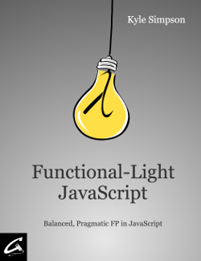

<<<<<<< HEAD
# PART1.语言

CH1.ES6

CH2.TypeScript (v3.1) <a style="color:#1293D8;font-size:12px;" href="https://www.typescriptlang.org/index.html">链接</a>

* TypeScript是JavsScript的超集。 
* 类型允许JavaScript开发者在开发JavaScript应用程序时使用高效的开发工具和常用操作比如静态检查和代码重构。 
* 类型是可选的，类型推断让一些类型的注释使你的代码的静态验证有很大的不同。类型让你定义软件组件之间的接口和洞察现有JavaScript库的行为。

CH3.Flow (v0.106.3) <a style="color:#1293D8;font-size:12px;" href="https://flow.org/">链接</a>

* Flow由Facebook团队开发维护 
* Flow是FLOW是JavaScript的静态类型检查器 

CH4.Reason <a style="color:#1293D8;font-size:12px;" href="https://reasonml.github.io/">链接</a>

* Flow由Facebook团队开发维护 
* Reason 并不是一门新语言，它是由一款久经沙场的语言 OCaml 驱动的新语法和工具链。 Reason 赋予了 OCaml 和 JavaScript 类似的语法，也迎合了前端程序员已经熟悉了的 NPM/YARN 工作流。 
* 在这点上，Reason 几乎可以被认为是 JavaScript 的表兄弟了。它有牢固的静态类型，更快也更简洁，除去了 JavaScript 的历史包袱，加上了也许到 ES2030 才有的特性，还能同时使用 JS 和 OCaml 的生态 
* 感谢我们的合作项目 BuckleScript 让 Reason 可以被编译成 JavaScript，BuckleScript 可以将 OCaml/Reason 平滑编译成可读的 JavaScript 代码。 同时，感谢 OCaml 自身的能力，Reason 也可以编译成快速的准系统汇编。 

CH5.Elm <a style="color:#1293D8;font-size:12px;" href="https://elm-lang.org/">链接</a>

CH6.ClojureScript (v1.10.520) <a style="color:#1293D8;font-size:12px;" href="https://clojurescript.org/index">链接</a>

* ClojureScript是针对JavaScript的Clojure编译器。它发出的JavaScript代码与Google Closure优化编译器的高级编译模式兼容
* ClojureScript旨在通过用Clojure替换JavaScript来解决客户端/嵌入式应用程序开发故事中的薄弱环节，Clojure是一种强大，简洁和强大的编程语言。在其实现中，ClojureScript采用了Google Closure库和编译器的策略，能够有效地利用这两种工具，获得大量的生产质量库和整个程序优化。ClojureScript为JavaScript到达的每个地方带来了丰富的数据结构集，函数式编程，宏，读者，解构，多态构造，状态规则和Clojure的许多其他功能。

结论 

* 如今，使用其他可以被编译成 JavaScript 的语言进行开发已经非常普遍了。不过，我们似乎已经忘记了它的发展历程。

* 曾经，CoffeeScript 统领了这种开发思路很久。然而，现在已经是 ES6 及其后续版本、TypeScript、Flow 的天下了。甚至是 Elm、Reason 这类与 JavaScript 语法截然不同的语言，都在或多或少地取代 CoffeeScript。

* 不得不说，这就是 JavaScript 未来发展的大方向。随着 Web Assembly 逐渐进入人们的视野，直接写 JavaScript 或许会渐渐地成为一种情怀，毕竟走在前沿的开发者已经开始投入 Rust 的怀抱。

* 不过，那个时代还没有真正到来。目前，更多开发者还是会选择 ES6 或 TypeScript。同时，建议大家也关注一下 Reason，它是由 Facebook 开发并维护的。根据今年的调查结果，Reason 的开发者满意度和感兴趣程度都很高。
=======
# Functional-Light JavaScript

 

## Table of Contents

* [Foreword](foreword.md/#foreword)
* [Preface](preface.md/#preface)
* [Chapter 1: Why Functional Programming?](ch1.md/#chapter-1-why-functional-programming)
  * [At a Glance](ch1.md/#at-a-glance)
  * [Confidence](ch1.md/#confidence)
  * [Communication](ch1.md/#communication)
  * [Readability](ch1.md/#readability)
  * [Perspective](ch1.md/#perspective)
  * [How to Find Balance](ch1.md/#how-to-find-balance)
  * [Resources](ch1.md/#resources)
* [Chapter 2: The Nature Of Functions](ch2.md/#chapter-2-the-nature-of-functions)
  * [What Is A Function?](ch2.md/#what-is-a-function)
  * [Function Input](ch2.md/#function-input)
  * [Named Arguments](ch2.md/#named-arguments)
  * [Function Output](ch2.md/#function-output)
  * [Functions Of Functions](ch2.md/#functions-of-functions)
  * [Syntax](ch2.md/#syntax)
  * [What's This?](ch2.md/#whats-this)
* [Chapter 3: Managing Function Inputs](ch3.md/#chapter-3-managing-function-inputs)
  * [All For One](ch3.md/#all-for-one)
  * [Adapting Arguments to Parameters](ch3.md/#adapting-arguments-to-parameters)
  * [Some Now, Some Later](ch3.md/#some-now-some-later)
  * [One At A Time](ch3.md/#one-at-a-time)
  * [Order Matters](ch3.md/#order-matters)
  * [No Points](ch3.md/#no-points)
* [Chapter 4: Composing Functions](ch4.md/#chapter-4-composing-functions)
  * [Output To Input](ch4.md/#output-to-input)
  * [General Composition](ch4.md/#general-composition)
  * [Reordered Composition](ch4.md/#reordered-composition)
  * [Abstraction](ch4.md/#abstraction)
  * [Revisiting Points](ch4.md/#revisiting-points)
* [Chapter 5: Reducing Side Effects](ch5.md/#chapter-5-reducing-side-effects)
  * [Effects On The Side, Please](ch5.md/#effects-on-the-side-please)
  * [Once Is Enough, Thanks](ch5.md/#once-is-enough-thanks)
  * [Pure Bliss](ch5.md/#pure-bliss)
  * [There Or Not](ch5.md/#there-or-not)
  * [Purifying](ch5.md/#purifying)
* [Chapter 6: Value Immutability](ch6.md/#chapter-6-value-immutability)
  * [Primitive Immutability](ch6.md/#primitive-immutability)
  * [Value To Value](ch6.md/#value-to-value)
  * [Reassignment](ch6.md/#reassignment)
  * [Performance](ch6.md/#performance)
  * [Treatment](ch6.md/#treatment)
* [Chapter 7: Closure vs Object](ch7.md/#chapter-7-closure-vs-object)
  * [The Same Page](ch7.md/#the-same-page)
  * [Look Alike](ch7.md/#look-alike)
  * [Two Roads Diverged In A Wood...](ch7.md/#two-roads-diverged-in-a-wood)
* [Chapter 8: Recursion](ch8.md/#chapter-8-recursion)
  * [Definition](ch8.md/#definition)
  * [Declarative Recursion](ch8.md/#declarative-recursion)
  * [Stack](ch8.md/#stack)
  * [Rearranging Recursion](ch8.md/#rearranging-recursion)
* [Chapter 9: List Operations](ch9.md/#chapter-9-list-operations)
  * [Non-FP List Processing](ch9.md/#non-fp-list-processing)
  * [Map](ch9.md/#map)
  * [Filter](ch9.md/#filter)
  * [Reduce](ch9.md/#reduce)
  * [Advanced List Operations](ch9.md/#advanced-list-operations)
  * [Method vs. Standalone](ch9.md/#method-vs-standalone)
  * [Looking For Lists](ch9.md/#looking-for-lists)
  * [Fusion](ch9.md/#fusion)
  * [Beyond Lists](ch9.md/#beyond-lists)
* [Chapter 10: Functional Async](ch10.md/#chapter-10-functional-async)
  * [Time As State](ch10.md/#time-as-state)
  * [Eager vs Lazy](ch10.md/#eager-vs-lazy)
  * [Reactive FP](ch10.md/#reactive-fp)
* [Chapter 11: Putting It All Together](ch11.md/#chapter-11-putting-it-all-together)
  * [Setup](ch11.md/#setup)
  * [Stock Events](ch11.md/#stock-events)
  * [Stock Ticker UI](ch11.md/#stock-ticker-ui)
* [Appendix A: Transducing](apA.md/#appendix-a-transducing)
  * [Why, First](apA.md/#why-first)
  * [How, Next](apA.md/#how-next)
  * [What, Finally](apA.md/#what-finally)
* [Appendix B: The Humble Monad](apB.md/#appendix-b-the-humble-monad)
  * [Type](apB.md/#type)
  * [Loose Interface](apB.md/#loose-interface)
  * [Just a Monad](apB.md/#just-a-monad)
  * [Maybe](apB.md/#maybe)
  * [Humble](apB.md/#humble)
* [Appendix C: FP Libraries](apC.md/#appendix-c-fp-libraries)
  * [Stuff to Investigate](apC.md/#stuff-to-investigate)
  * [Ramda](apC.md/#ramda-0230)
  * [Lodash/fp](apC.md/#lodashfp-4174)
  * [Mori](apC.md/#mori-032)
  * [Bonus: FPO](apC.md/#bonus-fpo)
  * [Bonus #2: fasy](apC.md/#bonus-2-fasy)
>>>>>>> feature/1.0
