# Chapter 4: 快排及随机化算法

## 1. 快速排序
 - 由C.A.R. Hoare于1962年提出.
 - 分治算法（Divide-and-conquer algorithm）.
 - “in place”排序 (像插入（insertion）排序，但不像归并（merge）排序).
 - 非常实用(与调谐tuning).

## 2. 分治（Divide and conquer）

&nbsp;&nbsp;快速排序一个"n-元素"的数组:

1. <font color="red">**Divide:**</font> 将数组围绕一个主x(<font color="red">**pivot x**</font>)划分为两个子数组，使下子数组中的元素≤x≤上子数组中的元素 。 
   
   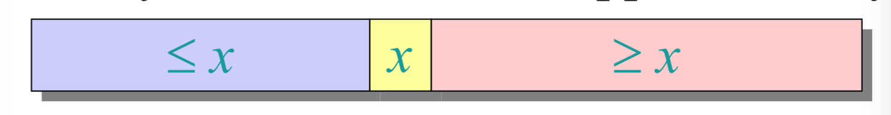
2. <font color="red">**Conquer:**</font> 递归地对两个子数组排序。
3. <font color="red">**Combine:**</font> 一些简单工作。  

&nbsp;&nbsp;&nbsp;&nbsp;&nbsp;&nbsp;&nbsp;&nbsp;<font color="red">**Key:**</font>线性时间分区子程序  

## 3. 分区子程序（Partitioning subroutine） 


1. 分区子程序伪代码
```js
PARTITION(A,p,q)  ⊳ A[p..q]
    x ← A[p]      ⊳ pivot = A[p] 
    i←p
    for j ← p + 1 to q
        do if A[j] ≤ x
            then i←i+1
                exchange A[i] ↔ A[j]
    exchange A[p] ↔ A[i]
    return i
```
<font color="red">**不变式（Invariant）:**</font> 
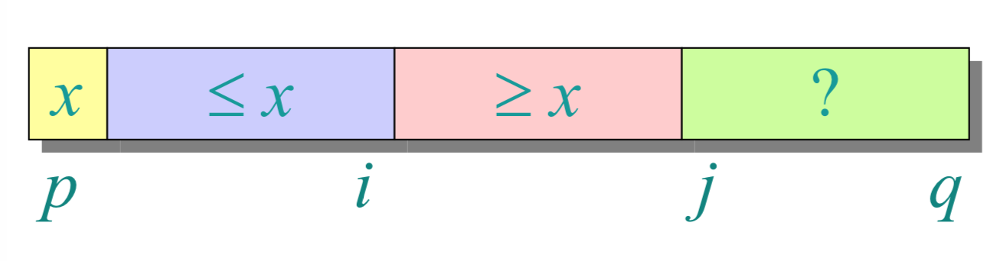 
   
2. 分区过程示例

&nbsp;&nbsp;A=[6,10,13,5,8,3,2,11],p=1,q=8 ,x=A[1]=6,i=1.   

 - step1:i=1,j=2  
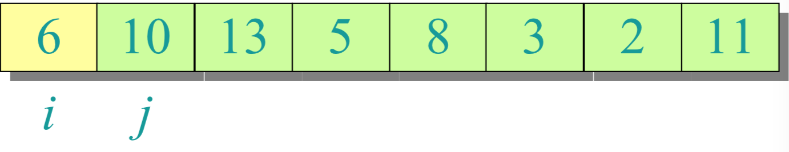
 - step2: A[j]=10>x, go(j+1) 
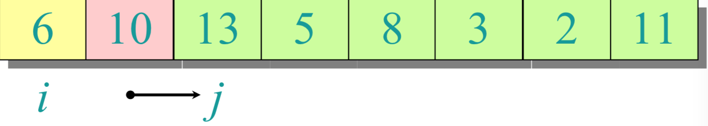
 - step3: j=3,A[j]=13 > x; go(j+1)</br>
&nbsp;&nbsp;&nbsp;&nbsp;&nbsp;&nbsp;j=4,A[j]=5 ≤ x; do(i=i+1=2),A[2] ↔ A[4]
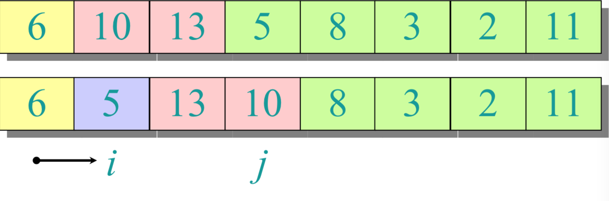
 - step4: i=2,j=4; go(j+1)
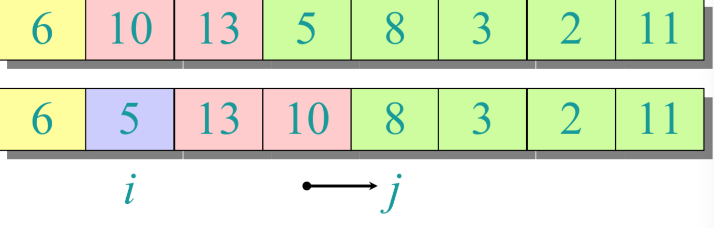
 - step5: j=5,A[j]=8 > x; go(j+1)
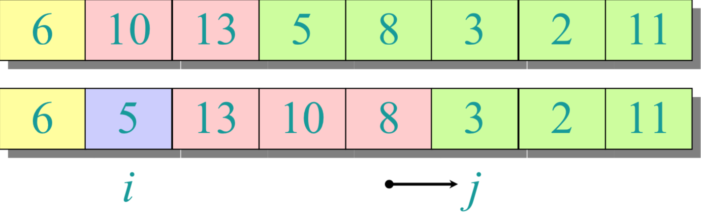
 - step6: j=6,A[j]=3 ≤ x; do(i=i+1=3),A[3] ↔ A[6]
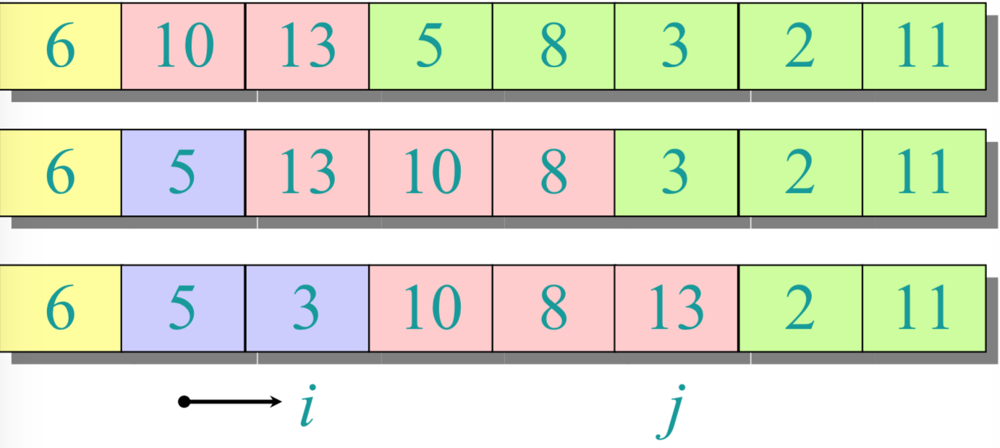
 - step7: i=3,j=6; go(j+1)
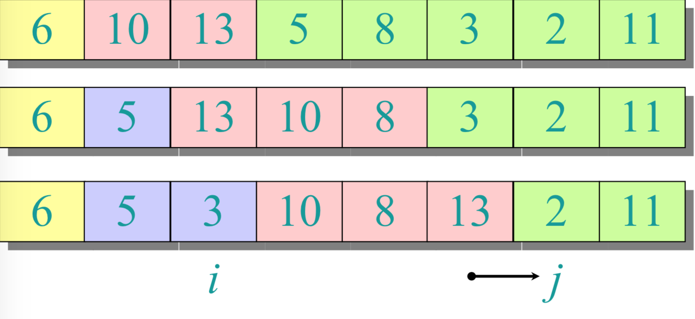
 - step8: j=7,A[j]=2 ≤ x; do(i=i+1=4),A[4] ↔ A[7]
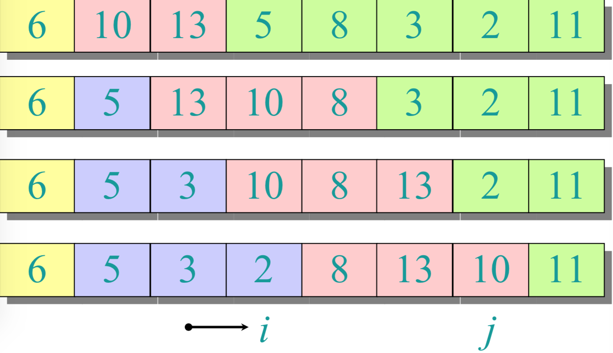
 - step9: i=4,j=7; go(j+1)
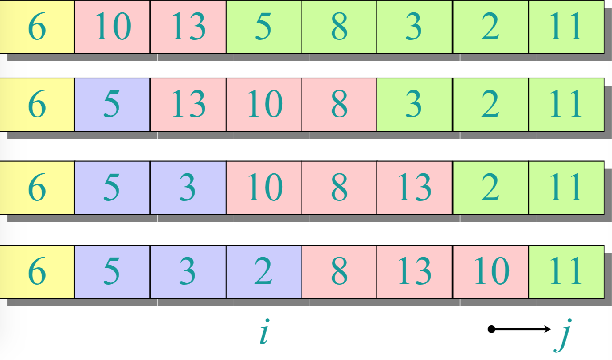
 - step10: j=8,A[j] > x; go(j+1)
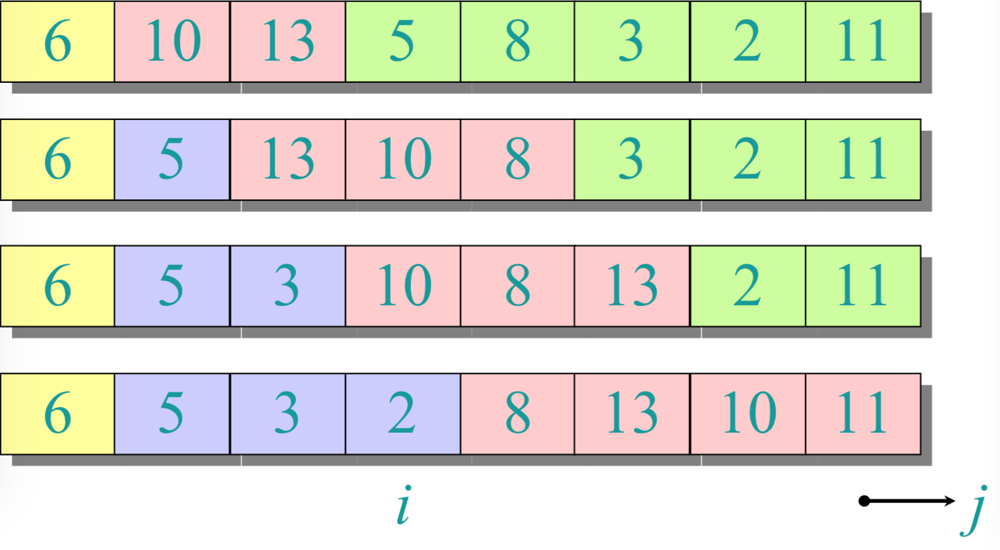
 - step11: j+1>q,for循环end. p=1,i=4,A[p] ↔ A[i].return i.
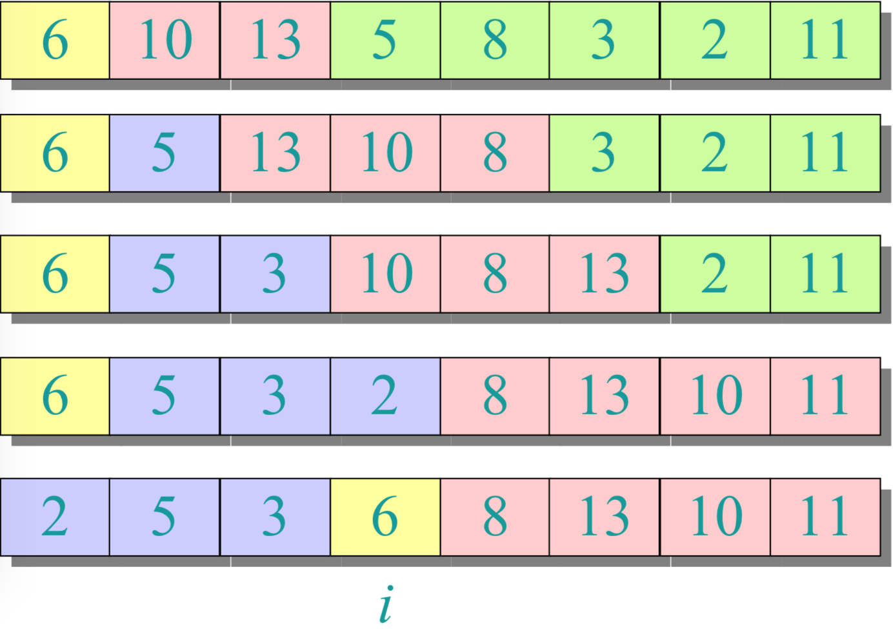

   
## 4. 快排算法伪代码
```js   
QUICKSORT(A, p, r)
    if p < r
        then q ← PARTITION(A, p, r) 
            QUICKSORT(A, p, q–1) 
            QUICKSORT(A, q+1, r)
```
初始调用:QUICKSORT(A, 1, n)

## 5. 分析快排算法
- 假设所有的输入元素都是不同的。
- 在实践中，有更好的分区算法来处理可能存在重复输入元素的情况。
- 设T(n) = n个元素的数组的最坏情况运行时间。


## 6 快排的最坏情况
- 输入已排序或反向排序。
- 围绕最小或最大元素划分。
- 分区的一边总是没有元素

$$
\begin{aligned}
T(n)
&=T(0)+T(n-1)\theta(n)\\
\\
&=\theta(1)+T(n-1)+\theta(n)\\
\\
&=T(n-1)+\theta(n)\\
\\
&=\theta(n^2)
\end{aligned}
$$ 

(arithmetic series:算术级数)

## 7 递归树最坏情况
T(n) = T(0) + T(n–1) + cn  

T(n)

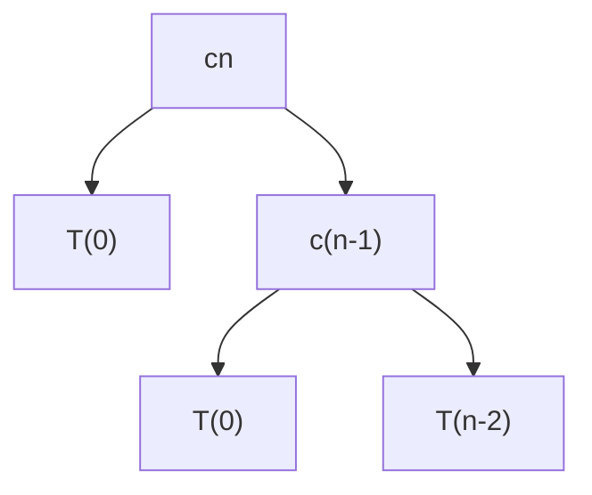

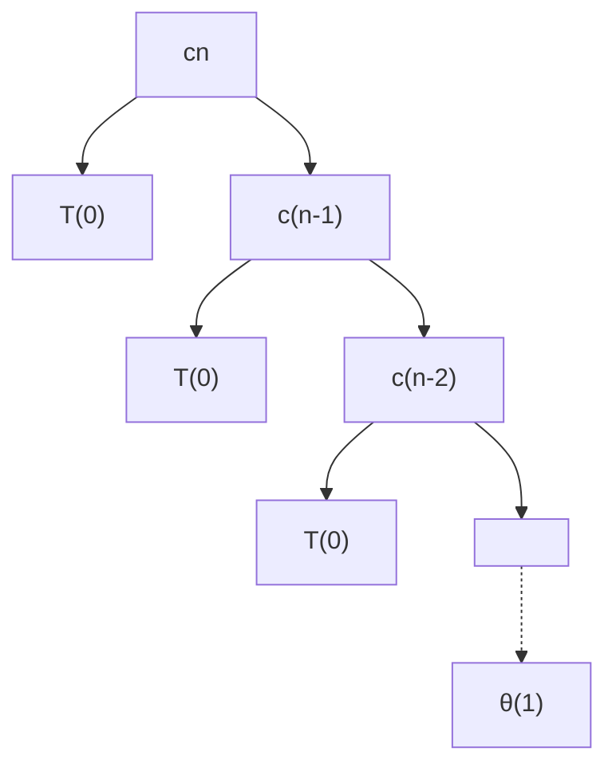

## 8. 最好情况分析  

1. 如果幸运的话，PARTITION会将数组平均分割:

$$
\begin{aligned}
T(n)
&=2T(n/2)+\theta(n)\\
&=\theta(nlgn)
\end{aligned}
$$
(和 merge sort 一样)  


2. 如果分割总是 $$\frac1{10} : \frac9{10}$$ ?

$$
T(n)=T(\frac1{10}n)+T(\frac9{10}n)+\theta(n)
$$
这个递归式的解是什么?

## 9. Analysis of “almost-best” case

## 10. More intuition  

假设我们轮流选择幸运，不幸，幸运，不幸，幸运，....

$$
\begin{cases}
L(n)=2U(n/2)+ \theta(n) & \text{lucky}\\
U(n)=L(n-1)+ \theta(n) & \text{unlucky}
\end{cases}
$$

Solving:  

$$
\begin{aligned}
L(n)
&=2(L(n/2-1)+\theta(n/2))+\theta(n)\\
&=2L(n/2-1)+\theta(n)\\
&=\theta(nlgn)
\end{aligned}
$$
<font color='red'>lucky!</font>

我们怎样才能确定我们通常是幸运的呢?

## 11. 随机快排

IDEA:围绕一个随机元素进行划分。
- 运行时间与输入无关秩序。
- 不需要对输入分布做任何假设。
- 没有特定的输入引出最坏情况的行为。
- 最坏的情况仅由随机数生成器的输出决定。

### 12. 随机快排分析

设T(n) = 输入规模为n的随机快速排序运行时间的随机变量，假设随机数是独立的。

For k = 0, 1, ..., n–1, 定义标志随机变量

$$x_k=
\begin{cases}
1 & \text{if PARTITION generates a k:n–k–1 split,}\\ 
0 & \text{其他}
\end{cases}
$$  

$$E[x_k]=Pr\{x_k=1\}=1/n$$,因为所有的分割都是相等的，假设元素是不同的.  

$$
\begin{aligned}
T(n)
&=
\begin{cases}
T(0)+T(n-1)+\theta(n) & \text{if 0:n-1 split,}\\ 
T(1)+T(n-2)+\theta(n) & \text{if 1:n-2 split,}\\ 
\vdots\\
T(n-1)+T(0)+\theta(n) & \text{if n-1,0 split.} 
\end{cases}\\
&=\sum_{k=0}^{n-1}X_k(T(k)+T(n-k-1)+\theta(n))
\end{aligned}
$$  


### 13. 计算期望值（Calculating expectation）
两边都取期望值：  
$$
\begin{aligned}
E[T(n)]
&=E\left[\sum_{k=0}^{n-1}X_k\Bigl(T(k)+T(n-k-1)+\theta(n)\Bigr)\right]\\
\\
&=\sum_{k=0}^{n-1}E\left[X_k\Bigl(T(k)+T(n-k-1)+\theta(n)\Bigr)\right]\\
\\
&=\sum_{k=0}^{n-1}E[X_k]\cdot E\left[T(k)+T(n-k-1)+\theta(n)\right]
\end{aligned}
$$  

- 线性期望
- $$X_k$$与其他随机选择相互独立

$$
\begin{aligned}
E[T(n)]
&=E\left[\sum_{k=0}^{n-1}X_k\Bigl(T(k)+T(n-k-1)+\theta(n)\Bigr)\right]\\
\\
&=\sum_{k=0}^{n-1}E\left[X_k\Bigl(T(k)+T(n-k-1)+\theta(n)\Bigr)\right]\\
\\
&=\sum_{k=0}^{n-1}E[X_k]\cdot E\left[T(k)+T(n-k-1)+\theta(n)\right]\\
\\
&=\frac1n\sum_{k=0}^{n-1}E[T(k)]+\frac1n\sum_{k=0}^{n-1}E[T(n-k-1)]+\frac1n\sum_{k=0}^{n-1}\theta(n)
\end{aligned}
$$    
线性的期望;$$E[X_k]=1/n$$

$$
\begin{aligned}
E[T(n)]
&=E\left[\sum_{k=0}^{n-1}X_k\Bigl(T(k)+T(n-k-1)+\theta(n)\Bigr)\right]\\
\\
&=\sum_{k=0}^{n-1}E\left[X_k\Bigl(T(k)+T(n-k-1)+\theta(n)\Bigr)\right]\\
\\
&=\sum_{k=0}^{n-1}E[X_k]\cdot E\left[T(k)+T(n-k-1)+\theta(n)\right]\\
\\
&=\frac1n\sum_{k=0}^{n-1}E[T(k)]+\frac1n\sum_{k=0}^{n-1}E[T(n-k-1)]+\frac1n\sum_{k=0}^{n-1}\theta(n)\\
\\
&=\frac2n\sum_{k=1}^{n-1}E[T(k)]+\theta(n)
\end{aligned}
$$
求和有相同的项

### 1. Hairy recurrence

$$
E[T(n)]=\frac2n\sum_{k=2}^{n-1}E[T(k)]+\theta(n)
$$  
(K=0,1项可以被放到（absorbed）$$\theta(n)$$里)
<font color='red'>Prove:</font> $$E[T(n)]\leq anlgn$$ 对于常量a>0  

选择足够大的a，使得对于足够小的n>=2,algn占E[T(n)]的主导地位.
(Choose a large enough so that a n lg n
dominates E[T(n)] for sufficiently small n ≥ 2)

<font color='red'>Use fact:</font>
$$\sum_{k=2}^{n-1}klgk \ge \frac12n^2lgn-\frac18n^2$$ 

### 2. Substitution method

##  14. 实践中的快速排序（Quicksort in practice）
- Quicksort是一个伟大的通用排序算法。
- 快速排序通常比归并排序快两倍以上。
- 快速排序可以从代码优化中获益良多。
- 即使使用缓存和虚拟内存，快速排序也能很好地运行。
