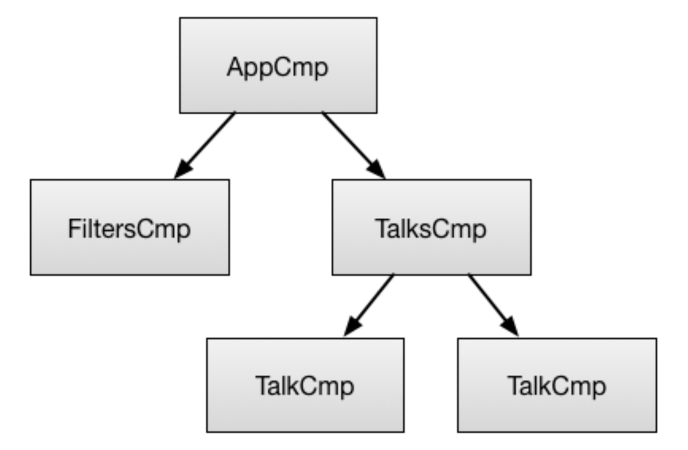
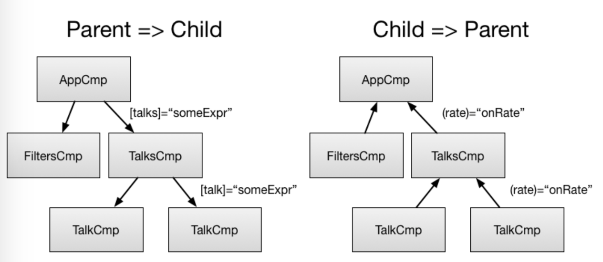

# Chapter 3: Components and Directives

**要构建Angular应用程序，您需要为每个UI元素、屏幕（screen）和路由定义一组组件。应用程序总是有包含所有其他组件的根组件（通常只有一个）。**为了使事情更简单，在这本书中让我们假设应用程序有一个根组件，因此我们的Angular应用程序将有一个组件树，可能如下所示：



AppCmp是根组件。FiltersCmp组件具有speaker input和filter button。TalksCmp是您在底部看到的列表。而TalkCmp就是其中一项。为了理解什么是组成了angular里的一个组件，让我们仔细看看TalkCmp。

```js
@Component({
    selector: 'talk-cmp',
    template: `
        {{talk.title}} {{talk.speaker}}
        {{talk.rating | formatRating }}
        <watch-button [talk]="talk"></watch-button>
        <rate-button [talk]="talk"></rate-button>
    `
})
class TalkCmp {
    @Input() talk: Talk;
    @Output() rate: EventEmitter; //...
}
```

## 1. Input and Output Properties

**组件具有输入和输出属性，这些属性可以在组件装饰器中定义，也可以使用属性装饰器定义.**

```js
class TalkCmp {
    @Input() talk: Talk; 
    @Output() rate: EventEmitter; //...
}

```

**数据通过输入属性流入组件。数据通过输出属性从组件中流出，**因此命名为：“input”和“output”。



输入和输出属性是组件的公共API。在应用程序中实例化组件时使用它们。

```js
<talk-cmp [talk]="someExp" (rate)="onRate($event.rating)"></talk-cmp>;
```

可以通过方括号使用属性绑定设置输入属性。你可以通过括号使用事件绑定订阅(subscribe)输出属性。

## 2. Template

组件有一个模板，它描述如何在页面上呈现组件。

```js
@Component({
    selector: 'talk-cmp',
    template: `
        {{talk.title}} {{talk.speaker}}
        {{talk.rating | formatRating}}
        <watch-button [talk]="talk"></watch-button>
        <rate-button [talk]="talk"></rate-button>
    `
})
class TalkCmp {}
```

可以内联定义模板（如上所示），也可以使用templateUrl在外部定义模板。除了模板之外，组件还可以使用style和styleurl属性定义样式。

```js
@Component({
    selector: 'talk-cmp',
    template: `
        {{talk.title}} {{talk.speaker}}
        {{talk.rating | formatRating}}
        <watch-button [talk]="talk"></watch-button>
        <rate-button [talk]="talk"></rate-button>
    `, 
    styles: [`
        watch-button {
            margin: 10px;
        } 
    `]
})
class TalkCmp {}
```

默认情况下，样式是封装的，因此上面定义的边距不会影响使用watch-button的任何其他组件。


## 3. LifeCycle

**组件有一个定义良好的生命周期，您可以利用它。**TalkCmp不订阅任何生命周期事件，但其他一些组件可以。例如，当该组件的输入属性发生更改时，会通知该组件。

```js
@Component({
    selector: 'cares-about-changes'
})
class CaresAboutChanges implements OnChanges {
    @Input() field1;
    @Input() field2;
    ngOnChanges(changes) { /**/ }
}

```

## 4. Providers

组件可以通过定义组件及其子组件可以注入的提供者(providers)列表来配置依赖注入。

```js
@Component({
    selector: 'conf-app',
    providers: [Logger]
})
class AppCmp {/**/ }
@Component({
  ...
})
class TalksCmp {
    constructor(logger:Logger) { /**/ } 
}
```

在本例中，我们在app组件中声明了logger服务，这使得它们在整个应用程序中可用。talks组件注入记录器服务。我将在第4章详细介绍依赖注入。现在，只要记住组件可以配置依赖注入。

## 5. Host Element

要将Angular组件转换为在DOM中呈现的内容，必须将Angular组件与DOM元素相关联。我们称这种元素为宿主元素（Host Element）。

组件可以通过以下方式与其宿主DOM元素交互：
- 它可以监听自己的事件。
- 它可以更新其属性。
- 它可以在上面调用方法。

例如，组件使用hostListeners监听输入事件，修剪值（trims the value），然后将其存储在字段中。Angular将存储值与DOM同步。

```js
@Directive({
    selector: '[trimmed-input]'
})
class TrimmedInput {
    @HostBinding() value: string;
    @HostListener("input", "$event.target.value")
    onChange(updatedValue: string) {
        this.value = updatedValue.trim();
    }
}
```

注意，我实际上并不直接与DOM交互。Angular旨在提供更高级别的API，因此本机平台(native platform),DOM将只反映Angular应用程序的状态。这很有用，有几个原因：

- 它使组件更容易重构。
- 它允许在不接触DOM的情况下对应用程序的大部分行为进行单元测试。这样的测试更容易编写和理解。此外，它们的速度明显更快。
- 它允许在web worker、服务器或其他本地DOM不存在平台上运行Angular应用程序。
- 有时您只需要直接与DOM交互。Angular提供了这样的API，但是我们希望您很少需要使用它们。

## 6. Queries

除了访问其宿主元素外，组件还可以与其子组件进行交互。组件可以有两种类型的子级：内容子级和视图子级。为了理解它们之间的区别，让我们看一下以下示例：

```js
@Component({
    selector: 'tab',
    template: `...`
})
class TabCmp {}
@Component({
    selector: 'tabs',
    template: `
        Tabs: 
        <div>   
            <ng-content></ng-content>
        </div>
        <div>
            <button (click)="selectPrev()">Prev</button>
            <button (click)="selectNext()">Next</button>
        </div> `
    })
class TabsCmp {}
@Component({
    template: `
        <tabs>
            <tab title="One"></tab>
            <tab title="Two"></tab>
            <tab title="Three"></tab>
        </tabs> `
    })
class CmpUsingTabs { }
```

tabs组件的内容子级是三个tab组件。tabs组件的用户提供了这些。“上一个”和“下一个”按钮是“选项卡”组件的视图子级。tabs组件的作者提供了这些。组件可以使用ContentChild、ContentChildren、ViewChildren和ViewChildren装饰器查询其子级。

Angular将在构建tabs组件期间设置此列表，并在创建、删除或重新排序内容子级时保持更新。我将在第五章中详细讨论这个问题。


## 7. Let's Recap

我列出的是一个组件。
- 组件知道如何与其宿主元素交互。
- 组件知道如何与其内容交互并查看子级。
- 组件知道如何呈现自身。
- 组件配置依赖注入。
- 组件具有定义良好的输入和输出属性公共API。

**所有这些组件都是Angular自描述的(self-describing)，因此它们包含实例化它们所需的所有信息。这是非常重要的。**

这意味着任何组件都可以引导(bootstrapped)。它不一定非得特别。此外，任何组件都可以加载到路由器出口(router outlet)。因此，您可以编写一个可以作为应用程序引导、作为路由加载或直接用于其他组件的组件。这导致需要学习的API更少。它还使组件更加可重用。


## 8. What About Directives?

如果你熟悉Angular1，你一定想知道“指令怎么了？”.

实际上指令仍然在这里。组件只是指令中最重要的类型，但不是唯一的类型。组件是带有模板的指令。但是您仍然可以编写decorator样式的指令(decorator-style directives)，这些指令没有模板。
