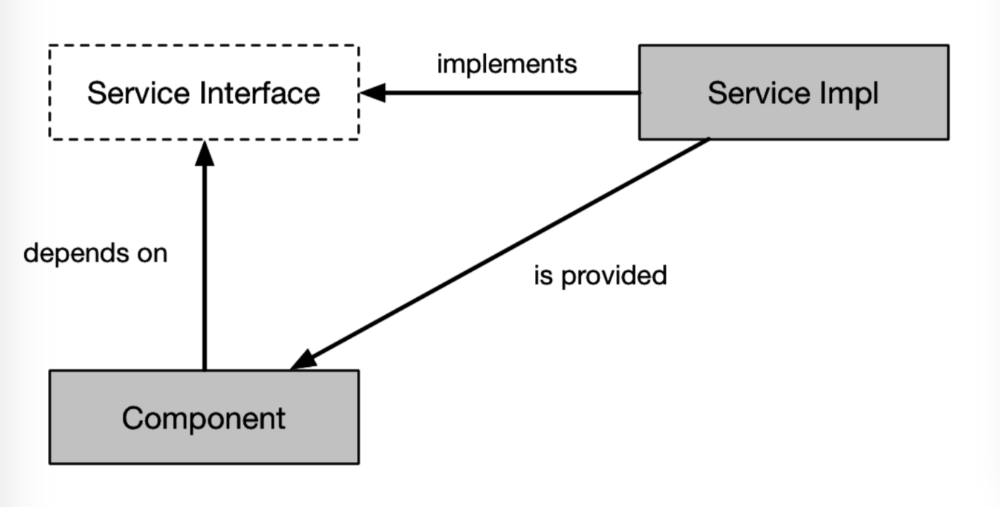
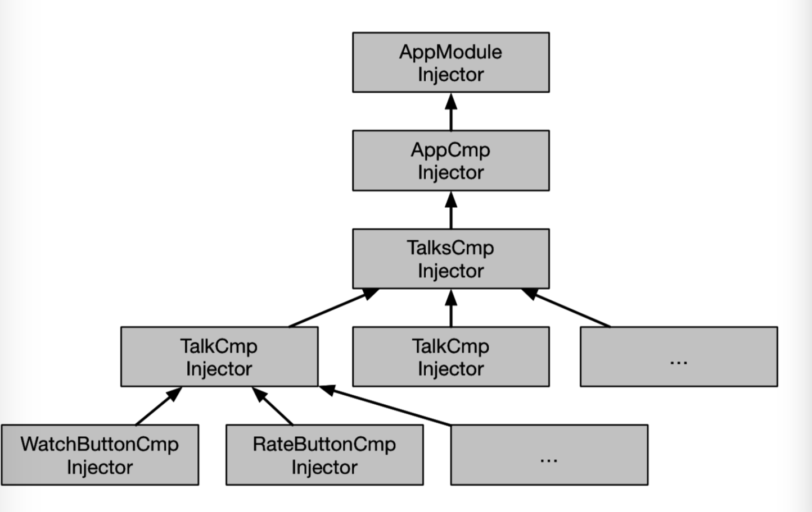
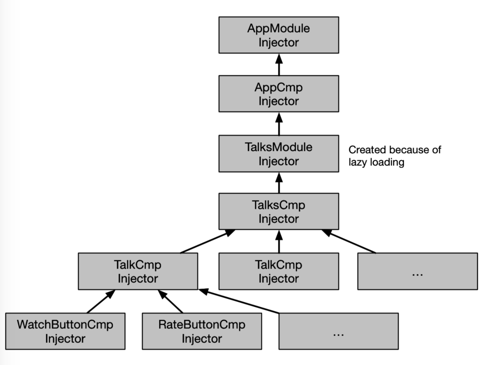
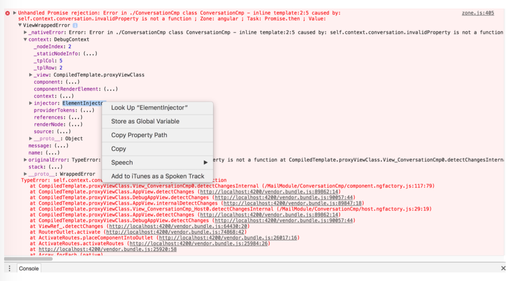
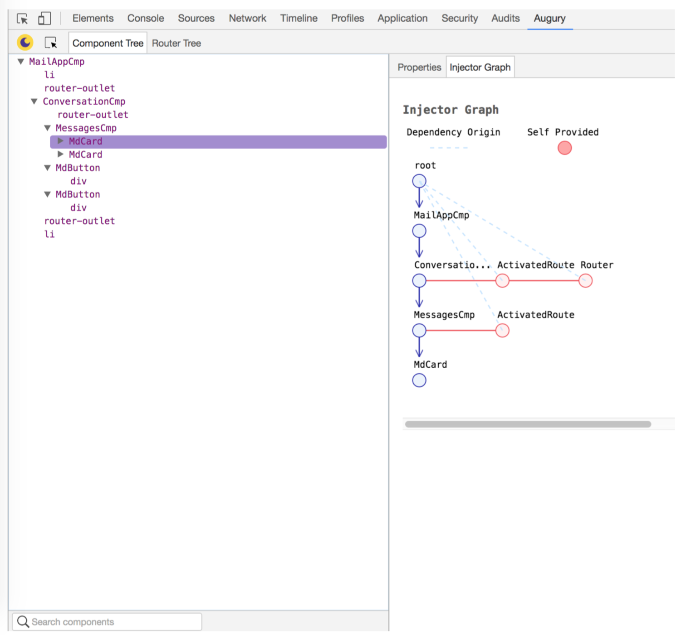

# Chapter 4: Dependency Injection

依赖注入背后的思想非常简单。如果您有一个依赖于服务的组件。您不需要自己创建该服务。相反，您在构造函数中请求一个，框架将为您提供一个。通过这样做，您可以依赖于接口而不是具体类型。这将导致更多的解耦代码，从而实现可测试性和其他伟大的事情。



Angular附带了一个依赖注入系统。为了了解如何使用它，让我们看一下下面的组件，它使用for指令呈现一个会话列表：

```js
@Component({
    selector: 'talks-cmp',
    template: `
        <h2>Talks:</h2>
        <talk *ngFor="let t of talks" [talk]="t"></talk>
    `
})
class TalksCmp {
    constructor() { /*..get the data*/ } 
}
```
让我们模拟一个简单的服务，它将为我们提供数据。

```js
class TalksAppBackend { 
    fetchTalks() {
        return [
            { name: 'Are we there yet?' },
            { name: 'The value of values' }
        ]; 
    }
}
```
你如何使用这项服务？一种方法是在我们的组件中创建此服务的实例。

```js
class TalksCmp { 
    constructor() {
        const backend = new TalksAppBackend();
        this.talks = backend.fetchTalks(); 
    }
}
```
这对于演示应用程序来说很好，但对于真正的应用程序来说并不好。在实际的应用程序中，后端不仅仅返回一个对象数组，它还会发出http请求来获取数据。这意味着这个组件的单元测试将产生真正的http请求——这不是一个好主意。此问题是由于您已将TalksCmp耦合到TalksAppBackend及其新运算符而导致的。

您可以通过将TalksAppBackend的实例注入构造函数来解决此问题，以便在测试中轻松替换它，如下所示：

```js
class TalksCmp { 
    constructor(backend:TalksAppBackend) {
        this.talks = backend.fetchTalks();
    }
}
```
这说明TalksCmp依赖于TalksAppBackend。现在，你需要告诉Angular怎么做创建TalksAppBackend的实例。

## 1. Registering Providers

要做到这一点，你需要注册一个提供者，有两个地方可以做到这一点。一个在组件装饰器中。

```js
@Component({
    selector: 'talks-cmp',
    template: `
        <h2>Talks:</h2>
        <talk *ngFor="let t of talks" [talk]="t"></talk>
    `,
    providers: [TalksAppBackend]
})
class TalksCmp { 
    constructor(backend:TalksAppBackend) {
        this.talks = backend.fetchTalks(); }
}
```
另一个在模块装饰器中。
```js
@NgModule({
    declarations: [FormattedRatingPipe, WatchButtonCmp, RateButtonCmp, TalkCmp, Ta\
lksCmp],
    exports: [TalksCmp],
    providers: [TalksAppBackend]
})
class TalksModule {}
```
有什么区别？你更喜欢哪一个？

通常，当提供者不依赖于DOM、组件或指令时，我建议在模块(module)级注册它们。只有必须限定到特定组件的UI相关提供程序才应该在组件(component)级别注册。因为TalksAppBackend与UI无关，所以在模块级注册它。

## 2. Injector Tree

现在您知道依赖注入配置有两部分：
- **注册提供者：**如何以及在何处创建对象。
- **注入依赖项：**对象依赖于什么。

对象所依赖的一切（服务、指令和元素）都被注入到其构造函数中。为了实现这一点，框架构建了一个注入器树(tree of injectors)。

首先，每个带有组件或指令的DOM元素都会得到一个注入器。这个注入器包含组件实例、组件注册的所有提供程序和一些“本地”对象（例如元素）。

第二，在引导(bootstrapping)NgModule时，Angular使用模块和在模块中定义的提供者(providers )创建一个注入器(injector)。

因此，应用程序的injector tree 将如下所示：



## 3. Resolution
这就是依赖解析算法(dependency resolution algorithm)的工作原理。

```js
// this is pseudocode.
let inj = this;
while (inj) {
    if (inj.has(requestedDependency)) {
        return inj.get(requestedDependency);
    } else {
        inj = inj.parent;
    } 
}
throw new NoProviderError(requestedDependency);
```
在解析TalksCmp的后端依赖时，Angular将从talks组件本身的注入程序(injector)开始。然后，如果不成功，它将上升到应用程序组件(app component)的注入器，最后，将上升到从AppModule创建的注入器。这就是为什么要解析TalksAppBackend，需要在TalkCmp、AppCmp或AppModule中注册它。

## 4. Lazy Loading
一旦开始使用懒加载，设置就会变得更加复杂。

懒加载模块类似于引导（bootstrapping）模块，因为它从模块外创建一个新的注入器（injector）并将其插入注入器树（injector tree）。要查看它的实际运行情况，让我们更新应用程序以延迟加载talks模块。

```js
@NgModule({
    declarations: [AppCmp],
    providers: [RouterModule.forRoot([
        {path: 'talks', loadChildren: 'talks'}
    ])]
})

class AppModule {}

@NgModule({
    declarations: [FormattedRatingPipe, WatchButtonCmp, RateButtonCmp, TalkCmp, TalksCmp],
    entryComponents: [TalksCmp],
    providers: [TalksAppBackend, RouteModule.forChild([
        {path: '', component: TalksCmp}
    ])]
})

class TalksModule {}
```
进行此更改后，injector tree将如下所示：



## 5. Getting Injector

您可以使用ngProbe戳与页面上的元素相关联的注入器。当抛出异常时，还可以看到元素的injector。



右键单击这些对象中的任何一个，将它们存储为全局变量，以便可以在控制台中与它们交互。


## 6. Visualizing Injector Tree

如果您更喜欢视觉效果，请使用$$\#Angular Augury^3$$  chrome 扩展检查组件和 injector trees。



## 7. Advanced Topics


### 7.1 Controlling Visibility

您可以更具体地从何处获取依赖项。例如，您可以在同一元素上请求另一个指令。

```js
class CustomInputComponent { 
    constructor(@Self() f: FormatterDirective) {}
}
```
或者您可以在同一模板中请求一个指令，也就是说，您只能从同一HTML文件中注入一个祖先指令( ancestor directive)。

```js
class CustomInputComponent { 
    constructor(@Host() f: CustomForm) {}
}
```

最后，您可以请求跳过当前元素，这对于装饰现有提供者或构建树状结构非常方便。

```js
class SomeComponent {
    constructor(@SKipSelf() ancestor: SomeComponent) {}
}
```

### 7.2 Optional Dependencies

要将依赖项标记为可选的，请使用可选的decorator。

```js
class Login {
    constructor(@Optional() service: LoginService) {}
}
```

### 7.3 More on Registering Providers

将一个类传递到一个providers数组中与通过useClass使用provider是相同的，即下面的两个示例是相同的：

```js
@NgModule({
    providers: [SomeClass ]
})

class MyModule {}

@NgModule({
    providers: [
        { provide: SomeClass, useClass: SomeClass}
    ]
})

class MyModule {}

```

当useClass不能满足时，可以使用useValue、useFactory和useExisting配置providers

```js
@NgModule({
    providers: [
        { provide: 'one', useValue: 1},
        { provide: 'sameOne', useExisting: 'one'},
        { provide: 'sum', useFactory: (one, sameOne) => one + sameOne, deps: ['one','sameOne']}
    ]
})

class MyModule {
    constructor(@Inject('sum') sum: number) {
        console.log("sum", sum);
    } 
}

```

如上所示，当类型参数与提供的令牌不匹配时，我们可以使用 @inject 装饰器来配置依赖项。

### 7.3 Aliasing

组件和服务使用别名是很常见的。

```js
@Component({
    selector: 'component-reexporting-itself',
    providers: [
        {provide: 'alias', useExisting: forwardRef(() => ComponentReexportingItself)}
    ]
})

class ComponentReexportingItself {}
```

现在我们可以使用@Inject（ComponentReexportingItself）和@Inject（'alias'）来注入这个组件

### 7.4 Overrides

导入模块的提供者从左到右与目标模块的提供者合并，即，如果多个导入模块定义同一提供者，则最后一个将获胜。

```js
@NgModule({
    providers: [
        {provide: 'token', useValue: 'A'}
    ]
})
class ModuleA {}

@NgModule({
    providers: [
        {provide: 'token', useValue: 'B'}
    ]
})
class ModuleB {}

@NgModule({
    imports: [ModuleA, ModuleB]
})
class ModuleC {
    constructor(@Inject('token') t: string) { 
        console.log(t); // will print 'B'
    } 
}
```
上面的例子将打印出来 ‘B’. 如果我们把ModuleC改成自己的 ‘token’ provider，将使用该provider，并打印示例‘C’.

```js

@NgModule({
    imports: [ModuleA, ModuleB],
    providers: [
        {provide: 'token', useValue: 'C'}
    ]
})
class ModuleC {
    constructor(@Inject('token') t: string) { 
        console.log(t); // will print 'C'
    } 
}
```

## 8. Let's Recap

- 依赖注入是Angular的关键组成部分。
- 您可以在组件或模块级别配置依赖注入。
- 依赖注入允许我们依赖接口而不是具体类型。
- 这会产生更多的解耦代码。
- 这提高了可测试性。
