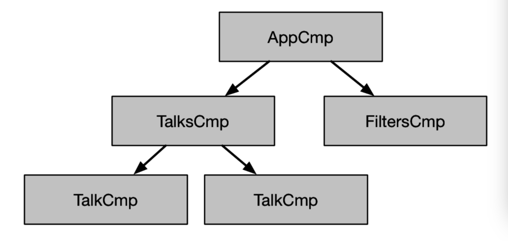
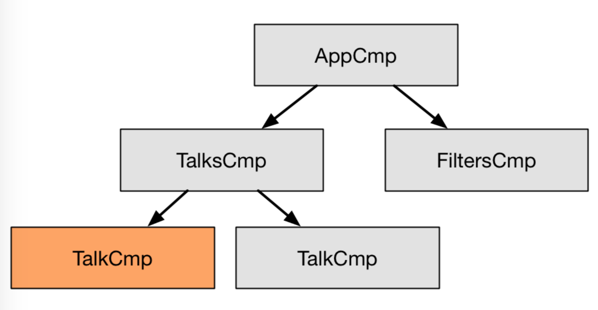

# Chapter 5: Change Detection

## 1. Two Phases

**Angular将更新应用程序模型和在视图中反映模型状态分为两个不同的阶段。**开发人员负责更新应用程序模型。通过变化检测，Angular通过绑定，即通过变化检测，负责在视图中反映模型的状态。这个框架在每一个VM回合中都会自动执行。

**事件绑定，**可以使用()语法添加，可用于捕获浏览器事件或组件输出，以便对组件或指令执行某些功能。所以它们经常触发第一阶段。

**属性绑定，**可以使用[]语法添加，应仅用于反映视图中模型的状态。

正如我们所了解的，Angular应用程序由嵌套的组件组成，因此它总是有一个组件树。假设此应用程序如下所示：


接下来，定义将存储应用程序状态的应用程序模型。

```js
{
    "filters": {"speakers": "Rich Hickey"},
    "talks": [
        {
            "id":898,
            "title": "Are we there yet", 
            "speaker": "Rich Hickey",
            "yourRating":null, 
            "rating": 9.1
        }, 
    ]
}
```

现在，想象一个事件改变了模型。假设我看了演讲“Are we there yet”，我真的很喜欢它，我决定给它9.9分。
下面的代码片段显示了一种方法。当用户对通话进行评分时，通过事件绑定调用handleRate函数。

```js
Component({
    selector: 'talk',
    template: `
        {{talk.title}} {{talk.speaker}}
        {{talk.rating | formatRating}}
        <watch-button [talk]="talk"></watch-button>
        <rate-button [talk]="talk" (rate)="handleRate($event)"></rate-button>
    `
})

class TalkCmp {
    @Input() talk:Talk;
    constructor(private app: App){}
    handleRate(newRating: number) { 
        this.app.rateTalk(this.talk, newRating);
    } 
}

@Component({
    selector: 'talks',
    template: `
        <h2>Talks:</h2>
        <talk *ngFor="let t of app.talks" [talk]="t"></talk>
    `
})

class TalksCmp {
    constructor(public app: App) {} 
}

// contains the business logic
class App {
    talks: Talk[] = [];
    rateTalk(talk: Talk, rating: number){
        // model is immutable, so we have to build a new model object 
        // constructing a new talk instance with an updated rating 
        const updatedTalk = updateRecord(talk, {rating});

        // constructing a new collection instance
        this.talks = updateArray(this.talks, updatedTalk); }
    }
}

```
在本例中，我们不会对会话进行变化（mutate），而是在每次发生更改时创建一个新的talks数组(create a new array of new talks)，这会产生一些好的属性。但值得注意的是，Angular并不要求我们使用不可变对象，我们可以很容易地编写谈话.talk.rating = newRating.

好的，rateTalk执行后，更新的模型将如下所示：

```js
{
    "filters": {"speakers": "Rich Hickey"},
    "talks": [
        {
            "id":898,
            "title": "Are we there yet",
            "speaker": "Rich Hickey",
            "yourRating": 9.9,
            "rating": 9.1
        },
    ]
}

```
在这一时点上，视图没有改变。只有模型已更新。
接下来，在VM回合结束时，变更检测（change detection）开始在视图中传播变更。

**首先，变更检测遍历组件树中的每个组件，以检查它所依赖的模型是否已更改。如果有，它会更新组件。**在本例中，第一个talk组件得到更新：



然后，框架更新DOM。在我们的示例中，rate按钮被禁用，因为我们不能对同一个通话进行两次评级。
注意，框架使用了变更检测和属性绑定来执行这个阶段。

在我们的示例中，我们使用共享状态和不可变数据。但是，即使使用本地状态和可变数据，也不会改变应用程序模型更新( application model update)和视图状态传播(the view state propagation)分离的特性。

## 2. Why?

现在，当我们理解了如何将这两个阶段分开时，让我们谈谈我们为什么这么做。

### 2.1 Predictability

首先，仅将变更检测用于更新视图状态限制了可以更改应用程序模型(model)的位置的数量。在本例中，它只能发生在rateTalk函数中。观察者不能“自动” 更新它。这使得确保不变量更容易，这使得代码更容易进行故障排除和重构。

其次，它帮助我们理解视图状态传播。考虑一下我们可以通过孤立地观察talk组件来说明什么。由于我们使用不可变的数据，我们知道只要我们不在talk组件中执行talk=，更改组件显示内容的唯一方法就是更新输入。这些都是强有力的保证，使我们能够孤立地思考这一部分。

最后，通过明确说明应用程序和框架负责什么，我们可以对每个部分设置不同的约束。例如，在应用程序模型中有循环是很自然的。所以框架应该支持它。另一方面，html强制组件形成树结构。我们可以利用这一点，使系统更具可预测性。

**从angular2.x开始，考虑组件就变得更容易了，因为框架限制了修改组件的方式，而且这些修改是可预测的。**

### 2.2 Performance

分离的主要好处是它允许我们限制视图状态的传播。这使系统更具可预测性，但也使其性能更高。例如，Angular中的变更检测图可以建模为一棵树，这一事实允许我们去掉摘要(digest) TTL(multiple digest runs until no changes occur:多次摘要运行，直到没有变更发生）。现在系统在一次通过后就稳定了。

## 3. How Does Angular Enforce it?

如果我试图打破分离会怎样？如果我尝试在由变更检测系统调用的setter中更改应用程序模型呢？

Angular尝试确保我们为组件定义的setter只更新此组件或其子组件的视图状态，而不更新应用程序模型。为此，Angular将在开发人员模式下检查所有绑定两次。第一次传播更改(propagate changes)，第二次确保没有更改。如果在第二次传递过程中发现更改，则意味着我们的一个setters更新了应用程序模型，框架将抛出一个异常，指向发生冲突的位置。

## 4. Content and View Children

前面我说过“更改检测遍历组件树中的每个组件，以检查它所依赖的模型是否已更改”，但没有说明框架是如何做到这一点的。它是按什么顺序做的？理解这一点是至关重要的，这就是我将在本节中介绍的内容。

组件可以有两种类型的子级：内容子级和视图子级。为了理解它们之间的区别，让我们看一下以下示例：

```js
@Component({
    selector: 'tab',
    template: `...`
})
class TabCmp { }

@Component({
    selector: 'tabs',
    template: `
        Number of tabs: {{tabs.length}}
        <div>
            <ng-content></ng-content>
        </div>
        <div>
            <button (click)="selectPrev()">Prev</button>
            <button (click)="selectNext()">Next</button>
        </div> `
})
class TabsCmp {
    @ContentChildren(TabCmp) tabs: QueryList<Tab>;
}

@Component({
    template: `
        <tabs>
            <tab title="One"></tab>
            <tab title="Two"></tab>
            <tab title="Three"></tab>
        </tabs> `
})
class CmpUsingTabs { }
```

tabs组件的内容子级是三个tab组件。tabs组件的用户提供了这些。“上一个”和“下一个”按钮是“选项卡”组件的视图子级。tabs组件的作者提供了这些。

这是Angular检查绑定的顺序：
- 它将首先检查tabs组件的绑定，其中没有绑定。
- 它将检查三个选项卡组件，即选项卡组件的内容子级。
- 它将检查选项卡组件的模板。

## 5. ChangeDetectionStrategy.OnPush

如果我们使用多个组件共享的可变对象，Angular就无法知道这些组件何时会受到影响。组件可以影响系统中的任何其他组件。这就是为什么默认情况下，Angular不会对组件所依赖的内容进行任何假设。所以它必须保守，在每个浏览器事件中检查每个组件的每个模板。由于框架必须对每个组件都执行此操作，因此即使Angular的新版本中的更改检测速度快得多，它也可能成为一个性能问题。

如果我们的模型应用程序状态使用不可变对象，如上面的示例中所示，那么我们可以更多地了解talk组件何时可以更改。当且仅当组件的任何输入发生变化时，组件才能发生变化。我们可以通过将变化检测策略设置为OnPush来与Angular通信。

```js
Component({
    selector: 'talk',
    template: `
        {{talk.title}} {{talk.speaker}}
        {{talk.rating | formatRating}}
        <watch-button [talk]="talk"></watch-button>
        <rate-button [talk]="talk" (rate)="handleRate($event)"></rate-button>
    `,
    changeDetection: ChangeDetectionStrategy.OnPush
})
class TalkCmp { //...
}

```
使用此更改检测策略，可以限制Angular何时必须检查更新，从“任何时候可能发生更改”更改为“仅当此组件的输入发生更改时”。因此，该框架可以更有效地检测TalkCmp中的更改。如果没有输入更改，则无需检查组件的模板。除了依赖于不可变的输入，OnPush组件还可以具有局部可变状态。

## 6. Let's Recap
- 将更新应用程序模型和更新视图分开。
- 事件绑定用于更新应用程序模型。
- 更改检测使用属性绑定来更新视图。更新视图是单向和自顶向下的。这使系统更具可预测性和性能。
- 对于依赖于不可变输入且仅具有局部可变状态的组件，我们使用OnPush更改检测策略使系统更高效。