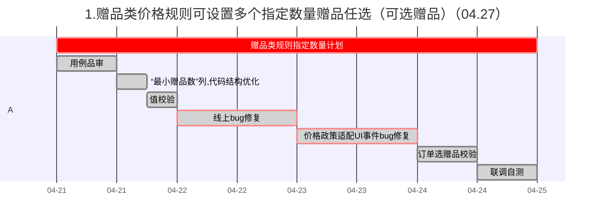
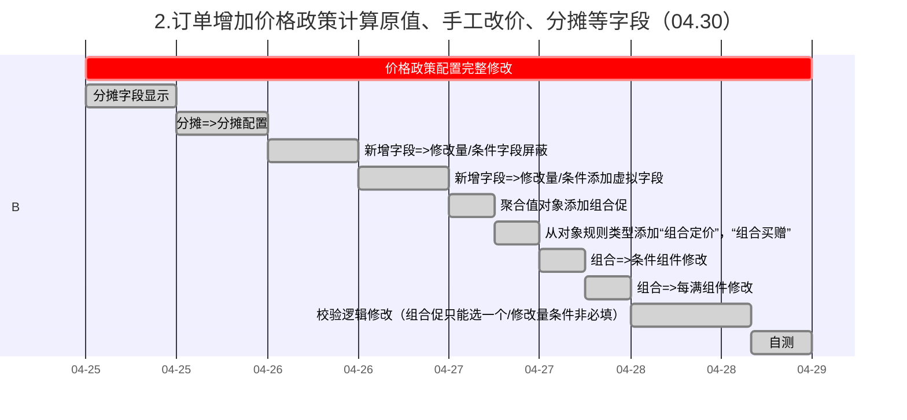
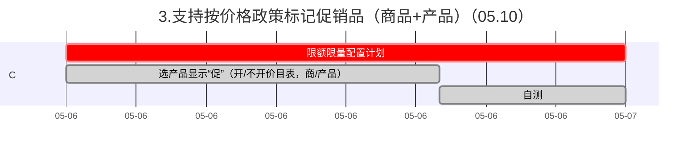
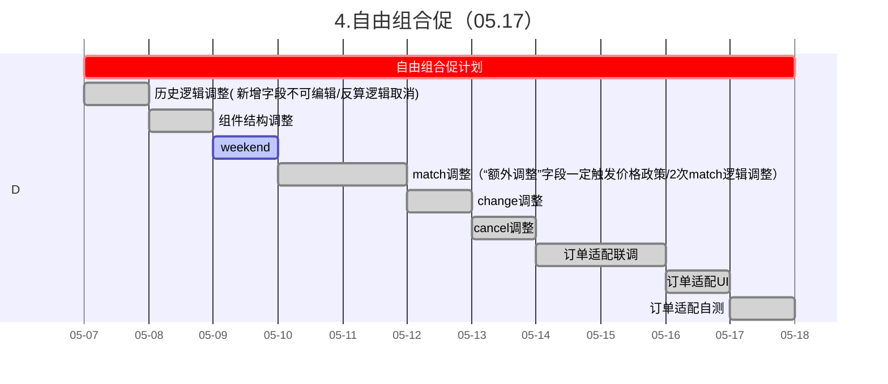
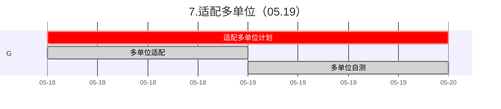
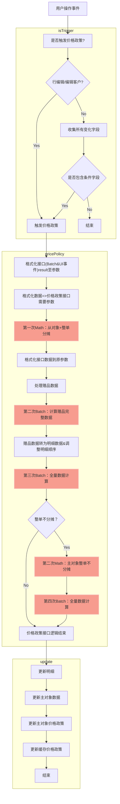

# 760 价格政策

```mermaid
gantt
        dateFormat  YYYY-MM-DD
        title 1.赠品类价格规则可设置多个指定数量赠品任选（可选赠品）（04.27）
        axisFormat  %m-%d

        section A
        赠品类规则指定数量计划          :crit,    2021-04-21, 2021-04-25
        用例品审                      :done,     des0,   2021-04-21, 12h
        “最小赠品数”列,代码结构优化      :done,     des1,    after des0, 6h
        值校验                        :done,     des2,    after des1,  6h
        线上bug修复                   :crit, done, desBug1,   2021-04-22, 1d
        价格政策适配UI事件bug修复       :crit, done, desUI,   after desBug1, 1d
        订单选赠品校验                 :done, des4,     after desUI, 12h
        联调自测                      :done, des5,     after des4, 12h

        
```

```mermaid
gantt
        dateFormat  YYYY-MM-DD
        title 2.订单增加价格政策计算原值、手工改价、分摊等字段（04.30）
        axisFormat  %m-%d

        section B
        价格政策配置完整修改            : crit,    2021-04-25, 2021-04-29
        分摊字段显示                   : done, desFenTan,   2021-04-25, 12h
        分摊=>分摊配置                 : done, desCondition,   after desFenTan, 12h
        新增字段=>修改量/条件字段屏蔽     : done, desField,   after desCondition, 12h
        新增字段=>修改量/条件添加虚拟字段   : done, desVField,   after desField, 12h
        聚合值对象添加组合促         :done, des11,    after desVField, 6h
        从对象规则类型添加“组合定价”，“组合买赠”    :done, des12,   after des11, 6h
        组合=>条件组件修改                :done, des13,   after des12, 6h
        组合=>每满组件修改                :done, des14,   after des13, 6h
        校验逻辑修改（组合促只能选一个/修改量条件非必填）   :done, des15,   after des14, 16h
        自测                       :done, des16,   after des15, 8h
       

```

```mermaid
gantt
        dateFormat  YYYY-MM-DD
        title 3.支持按价格政策标记促销品（商品+产品）（05.10）
        axisFormat  %m-%d

        section C
        限额限量配置计划           : crit,     2021-05-06, 2021-05-07
        选产品显示“促”（开/不开价目表，商/产品）       :done, desCu,    2021-05-06, 16h
        自测                     :done, desCuTest,    after desCu, 8h
```

```mermaid
gantt
        dateFormat  YYYY-MM-DD
        title 4.自由组合促（05.17）
        axisFormat  %m-%d

        section D
        自由组合促计划           : crit,     2021-05-07, 2021-05-18
        历史逻辑调整( 新增字段不可编辑/反算逻辑取消) :done, desHistory,   2021-05-07, 1d
        组件结构调整                      :done, desComp,   after desHistory, 1d
        weekend                   :active, desWeekend,   2021-05-09,  1d
        match调整（“额外调整”字段一定触发价格政策/2次match逻辑调整）  :done, desMatch,   2021-05-10, 2d
        change调整                 :done, desChange,   after desMatch, 1d
        cancel调整                 :done, desCancel,   after desChange, 1d
        订单适配联调                :done, desOrder,   after desCancel, 2d
        订单适配UI                 :done, desUI,          after desOrder, 1d
        订单适配自测                :done, desOrderTest,   after desUI, 1d

```

```mermaid
gantt
        dateFormat  YYYY-MM-DD
        title 7.适配多单位（05.19）
        axisFormat  %m-%d

        section G
        适配多单位计划        : crit,     2021-05-18, 2021-05-20
        多单位适配           :done, des27,    2021-05-18, 1d
        多单位自测           :done, des28,    after des27, 1d
```

```mermaid
graph TB
        A["用户操作事件"] --> T["是否触发价格政策?"]
        subgraph isTrigger
        T --> T1{"行编辑/编辑客户?"}
        T1 --> |Yes| P["触发价格政策"]
        T1 --> |No| T2["收集所有变化字段"]
        T2 --> T3{"是否包含条件字段"}
        T3 --> |Yes| P["触发价格政策"]
        T3 --> |No| T4["结束"]
        end
        subgraph pricePolicy
        P -->  P1["格式化接口(Batch&UI事件)result至参数"]
        P1 --> P2["格式化数据=>价格政策接口需要参数"]
        P2 --> P3["第一次Math：从对象+整单分摊"]
        P3 --> P31["格式化接口数据到原参数"]
        P31 --> P32["处理赠品数据"]
        P32 --> P4["第二次Batch：计算赠品完整数据"]
        P4 --> P41["赠品数据转为明细数据&调整明细顺序"]
        P41 --> P5["第三次Batch：全量数据计算"]
        P5 --> P6{"整单不分摊？"}
        P6 --> |Yes| P7["第二次Math：主对象整单不分摊"]     
        P6 --> |No| U["价格政策接口逻辑结束"]     
        P7 --> P8["第四次Batch：全量数据计算"] 
        P8 --> U  
        end
        subgraph update
        U --> U1["更新明细"]
        U1 --> U2["更新主对象数据"]
        U2 --> U3["更新主对象价格政策"]
        U3 --> U4["更新缓存价格政策"]
        U4 --> E["结束"]
        end
        style P3 fill:#F79C8F,stroke:#F7B7B4,stroke-width:2px
        style P4 fill:#F79C8F,stroke:#F7B7B4,stroke-width:2px
        style P5 fill:#F79C8F,stroke:#F7B7B4,stroke-width:2px
        style P7 fill:#F79C8F,stroke:#F7B7B4,stroke-width:2px
        style P8 fill:#F79C8F,stroke:#F7B7B4,stroke-width:2px
       
```