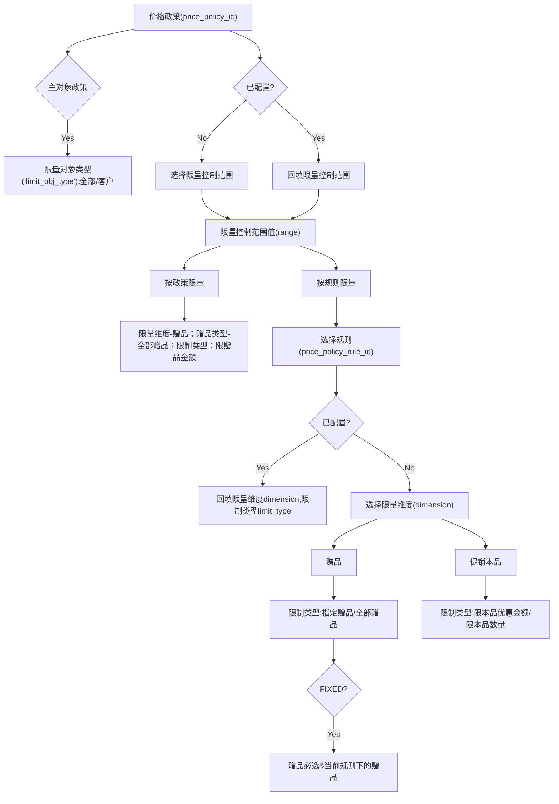

## 1. 限额限量

```mermaid
graph TD
A["价格政策(price_policy_id)"] --> B{"已配置?"}
A --> H{"主对象政策"}
H --> |Yes| I["限量对象类型('limit_obj_type'):全部/客户"]
B --> |Yes| C["回填限量控制范围"]
B --> |No| D["选择限量控制范围"]
D --> E
C --> E["限量控制范围值(range)"]
E --> F["按政策限量"]
E --> G["按规则限量"]
F --> J["限量维度-赠品；赠品类型-全部赠品；限制类型：限赠品金额"]
G --> K["选择规则(price_policy_rule_id)"]
K --> L{"已配置?"}
L --> |Yes| M["回填限量维度dimension,限制类型limit_type"]
L --> |No| N["选择限量维度(dimension)"]
N --> O["赠品"]
N --> P["促销本品"]
O --> Q["限制类型:指定赠品/全部赠品"]
Q --> R{"FIXED?"}
R --> |Yes| S["赠品必选&当前规则下的赠品"]
P --> T["限制类型:限本品优惠金额/限本品数量"]
```